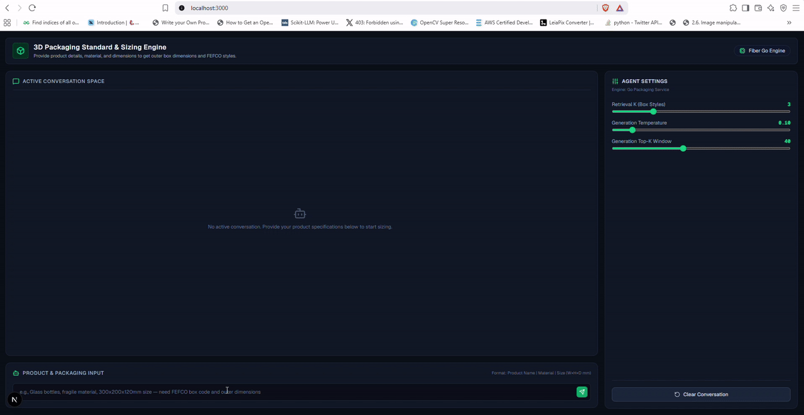

# 📦 3D Spatial Packaging Optimization Agent (Go + Next.js)
A localized, high-performance 3D Spatial Packing & Structural Packaging Optimization Platform. Built using a decoupled microservice architecture with a Go (Fiber) backend and an interactive Next.js frontend surface, it converts product specifications into optimized 3D container layouts, evaluates FEFCO box styles, and queries local LLMs for structural engineering recommendations.

## 🏗️ Architecture Blueprint
API & Business Engine: Go (Fiber v2) running high-concurrency native handlers for 3D spatial optimization algorithms, SQLite database interactions, and REST endpoints.

Interactive Frontend: Next.js (App Router) built with React, Tailwind CSS, and Lucide icons, featuring interactive 3D spatial visualizers and live chat UI.

Spatial Optimization Engine: Native Go bin-packing algorithms calculating 3D coordinate placements and volume utilization metrics.

Catalog Database: Local SQLite engine storing standard FEFCO box styles and corrugated board flute specifications.

Localized LLM Engine: Powered by self-hosted Ollama containers running locally with strict zero-data-leakage privacy boundaries.

API Documentation: Interactive OpenAPI/Swagger documentation auto-generated via Swag.

## 🎛️ Features & User Experience
📦 3D Spatial Layout Calculation: Generates exact 3D coordinates, dimensions, and color mappings for packed items.

📐 FEFCO & Material Catalog: Dynamic query interface for box styles and corrugated board flute specifications.

🤖 Local AI Recommendations: Local Ollama integration for structural packaging design suggestions without cloud API costs.

📖 Built-in OpenAPI / Swagger UI: Interactive endpoint documentation at /swagger/.

---

## 🐳 Option 1: Running Fully Containerized (Docker Compose)
Use this method to run the Go backend, Next.js UI, SQLite database, and Ollama engine inside isolated Docker environments.

### Step 1: Ensure Prerequisites are Met
Install Docker Desktop for Windows/Linux.

Verify Docker Compose is available (docker compose version).

### Step 2: Spin Up Infrastructure
Open your terminal in the project root directory and run:

```powershell
# Bring down existing containers and clean stale references
docker compose down

# Force rebuild application layers and boot containers in detached mode
docker compose up --build -d
```
### Step 3: Access Running Services
Once initialization is complete, access your services at:

Next.js Web Dashboard: http://localhost:3000

Go Backend API: http://localhost:8080

Swagger API Documentation: http://localhost:8080/swagger/index.html

## 💻 Option 2: Running Locally (Bare Metal)

Use this option to run the Go backend, Next.js frontend, and Ollama engine natively on your host machine.

### Step 1: Install & Boot Local Ollama Engine
Install Ollama on your host machine.

Pull your preferred local LLM model:

```powershell
ollama pull llama3.2
```
### Step 2: Set Up & Launch Go Backend
Open a terminal inside the /backend directory:

```powershell
# 1. Download dependencies
go mod download

# 2. Sync go.mod / go.sum
go mod tidy

# 3. Generate Swagger documentation (if swag CLI is installed)
swag init

# 4. Start the Go development server
go run main.go
```
The Go Fiber backend will be live at http://localhost:8080.

### Step 3: Set Up & Launch Next.js Frontend
Open a separate terminal inside the /frontend directory:
```powershell
# 1. Install Node modules
npm install

# 2. Set environment variables (.env.local)
# Create a .env.local file with:
# NEXT_PUBLIC_API_BASE_URL=http://localhost:8080

# 3. Start Next.js development server
npm run dev
```
Navigate your browser to http://localhost:3000 to access the interactive web interface.

